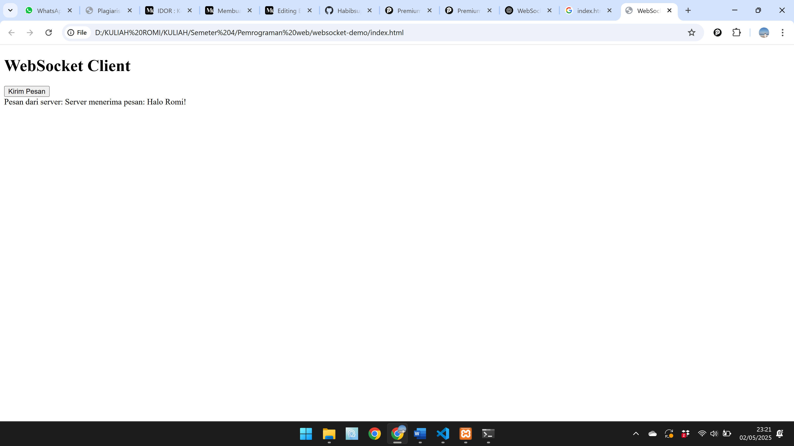

# UTS-Pemrograman-Web2
|Nama|NIM|Kelas|Mata Kuliah|
|----|---|-----|------|
|**Romi Rahman**|**312310581**|**TI.23.A6**|**Pemrograman Web 2**|
# WebSocket - Revolusi Komunikasi Dua Arah pada Aplikasi Web Modern

## Pembahasan Utama

WebSocket adalah protokol komunikasi yang memungkinkan komunikasi dua arah secara real-time antara klien dan server melalui koneksi TCP tunggal. Dalam proyek ini, kami mengimplementasikan WebSocket menggunakan `ws` di Node.js untuk mendemonstrasikan cara kerja komunikasi dua arah di aplikasi web modern.

### Fitur Utama:
- Menggunakan WebSocket untuk memungkinkan komunikasi dua arah secara real-time antara server dan klien.
- Server WebSocket berjalan di port 8080 dan dapat menerima pesan dari klien dan mengirimkan balasan secara instan.
- Klien mengirim pesan ke server, dan server mengirimkan balasan dengan pesan yang diterima.
  
### Langkah-langkah Implementasi:
1. **Membuat Koneksi WebSocket:**  
   Klien membuat koneksi WebSocket ke server dengan menggunakan JavaScript. Koneksi ini memungkinkan pengiriman dan penerimaan pesan secara dua arah.
   
2. **Server WebSocket:**  
   Server WebSocket dibuat menggunakan library `ws` di Node.js yang mendengarkan pada port 8080. Server ini dapat menangani beberapa klien yang terhubung secara bersamaan.

3. **Komunikasi Real-time:**  
   Klien dan server saling bertukar pesan dengan latensi rendah, memungkinkan interaksi instan tanpa memerlukan koneksi ulang.

## Cara Menjalankan Proyek Ini

### Prasyarat:
- Node.js dan npm harus terinstal di komputer Anda.

### Langkah-langkah Instalasi:
1. Instal Node.js: Pastikan Node.js sudah terinstal di komputer Anda. (Unduh di Node.js).

2. Unduh Proyek: Unduh file proyek dan ekstrak ke folder pilihan.

3. Instal Dependensi: Buka terminal di folder proyek dan jalankan:
```bash
npm install
```
4. Jalankan Server: Setelah dependensi terinstal, jalankan server dengan perintah:
```bash
node server.js
```
5. Akses Aplikasi: Buka browser dan akses aplikasi di:
```arduino
http://localhost:8080
```
## Penjelasan Kode
Klien (JavaScript):
```Javascript
// Membuat koneksi WebSocket baru
const socket = new WebSocket('ws://localhost:8080');

// Mendengarkan event saat koneksi dibuka
socket.addEventListener('open', (event) => {
  console.log('Koneksi WebSocket dibuka');
  socket.send('Halo Server! Ini pesan dari klien.');
});

// Mendengarkan event untuk menerima pesan
socket.addEventListener('message', (event) => {
  console.log('Pesan dari server:', event.data);
});

// Mendengarkan event untuk menangani error
socket.addEventListener('error', (event) => {
  console.error('Error WebSocket:', event);
});

// Mendengarkan event saat koneksi ditutup
socket.addEventListener('close', (event) => {
  console.log('Koneksi WebSocket ditutup. Kode:', event.code, 'Alasan:', event.reason);
});
```
Kode klien menggunakan WebSocket untuk membuat koneksi dan mengirim serta menerima pesan.

Setiap pesan yang dikirim dari klien diterima oleh server, dan server akan mengirimkan balasan.

Server (Node.js):
```Javascript
const WebSocket = require('ws');
const wss = new WebSocket.Server({ port: 8080 });

wss.on('connection', (ws) => {
  console.log('Klien baru terhubung');
  ws.send('Selamat datang di server WebSocket!');

  ws.on('message', (message) => {
    console.log('Pesan diterima dari klien:', message.toString());
    ws.send(`Server menerima pesan: ${message}`);
  });

  ws.on('close', () => {
    console.log('Klien terputus');
  });

  ws.on('error', (error) => {
    console.error('Error koneksi:', error);
  });
});
```
console.log('Server WebSocket berjalan di port 8080');

Server menggunakan library ws untuk mendengarkan koneksi WebSocket pada port 8080.

Setiap pesan yang diterima oleh server akan dikirimkan kembali ke klien sebagai respons.
## OUTPUT 



Setelah menjalankan kode di atas, hasil yang terlihat pada aplikasi web adalah sebagai berikut:

1. Pesan dari Server:
Pada gambar pertama, pesan yang diterima dari server adalah “Selamat datang di server WebSocket!”.
Pada gambar kedua, pesan yang diterima adalah “Server menerima pesan: Halo Romi!”, yang menunjukkan bahwa server berhasil menerima dan mengirimkan kembali pesan yang dikirim oleh klien.
2. Langkah-langkah yang Dijalankan:
Klien mengirimkan pesan dengan menekan tombol “Kirim Pesan”.
Server kemudian menerima pesan tersebut dan mengirimkan pesan balasan.
Pesan yang diterima dari server kemudian ditampilkan di halaman web klien.
## Keunggulan WebSocket
Efisiensi Bandwidth: Mengurangi overhead karena tidak perlu mengirimkan header HTTP pada setiap pertukaran data setelah koneksi dibuat.

Latensi Rendah: Koneksi tetap terbuka sehingga data dapat dikirim segera tanpa perlu handshake berulang.

Komunikasi Dua Arah: Server dapat mengirimkan data ke klien tanpa menunggu permintaan terlebih dahulu.

## Kasus Penggunaan
WebSocket sangat cocok digunakan dalam aplikasi yang membutuhkan komunikasi real-time, seperti:

Aplikasi Chat

Game Online

Dashboard Real-time

Platform Trading

Kolaborasi Dokumen

## Tantangan dan Solusi
Beberapa tantangan yang dihadapi dalam implementasi WebSocket:

Skalabilitas: Menjaga ribuan koneksi WebSocket bisa menjadi tantangan. Solusi menggunakan arsitektur berbasis event-driven seperti Node.js atau cluster WebSocket dengan load balancing.

Keamanan: WebSocket rentan terhadap serangan seperti Cross-site WebSocket Hijacking (CSWSH). Penggunaan WSS (WebSocket Secure) dan validasi data yang tepat adalah praktik terbaik.

Kompatibilitas: Beberapa perangkat atau browser lama mungkin tidak mendukung WebSocket. Fallback ke long polling dapat digunakan di kasus ini.

## Referensi
RFC 6455: The WebSocket Protocol

WebSocket API MDN

WebSocket.org

